# Technical Design: Daily Job Discovery & Notification

## Architecture Overview

```mermaid
sequenceDiagram
    participant Scheduler as GitHub Scheduler
    participant Workflow as Daily Discovery Workflow
    participant Library as job-search-automation
    participant IssueService as Issue Creation Service
    participant GitHub as GitHub API
    participant User as User (Email)

    Note over Scheduler: 9:00 AM (User Timezone)
    Scheduler->>Workflow: Trigger daily-job-discovery.yml
    Workflow->>Library: python -m job_search_automation.core.cli digest --format json
    Library-->>Workflow: JSON: {jobs: [...], summary: {...}}
    Workflow->>IssueService: Process JSON output
    IssueService->>GitHub: Create issue with job listings
    GitHub-->>User: Email: "🎯 3 New Job Opportunities"
    Note over User: 9:05 AM (5-minute SLA)
```



## Component Design

### 1. GitHub Actions Workflow (`daily-job-discovery.yml`)

```yaml
name: Daily Job Discovery
on:
  schedule:
    - cron: "0 9 * * 1-5" # 9 AM weekdays (UTC)
  workflow_dispatch: # Manual trigger for testing

jobs:
  discover-jobs:
    runs-on: ubuntu-latest
    timeout-minutes: 10

    steps:
      - name: Checkout repository
        uses: actions/checkout@v4

      - name: Setup Python
        uses: actions/setup-python@v4
        with:
          python-version: "3.11"

      - name: Install job search library
        run: pip install job-search-automation

      - name: Load user configuration
        run: |
          python scripts/load-user-config.py
          echo "CONFIG_LOADED=true" >> $GITHUB_ENV
        env:
          USER_CONFIG: ${{ secrets.USER_CONFIG }}
          ADZUNA_API_KEY: ${{ secrets.ADZUNA_API_KEY }}

      - name: Run job discovery
        id: discovery
        run: |
          output=$(python -m job_search_automation.core.cli digest --format json)
          echo "digest-json<<EOF" >> $GITHUB_OUTPUT
          echo "$output" >> $GITHUB_OUTPUT
          echo "EOF" >> $GITHUB_OUTPUT
        timeout-minutes: 5

      - name: Create digest issue
        uses: ./.github/actions/create-digest-issue
        with:
          digest-data: ${{ steps.discovery.outputs.digest-json }}
          github-token: ${{ secrets.GITHUB_TOKEN }}
```

### 2. Custom GitHub Action (`create-digest-issue`)

**File Structure:**

```
.github/actions/create-digest-issue/
├── action.yml
├── package.json
├── tsconfig.json
├── src/
│   ├── index.ts
│   ├── digest-processor.ts
│   └── issue-formatter.ts
└── dist/
    └── index.js  # Compiled output
```

**Action Definition (`action.yml`):**

```yaml
name: "Create Job Digest Issue"
description: "Creates a GitHub issue from job search digest data"
inputs:
  digest-data:
    description: "JSON output from job search library"
    required: true
  github-token:
    description: "GitHub token for API access"
    required: true
outputs:
  issue-number:
    description: "Number of created issue"
  issue-url:
    description: "URL of created issue"
runs:
  using: "node20"
  main: "dist/index.js"
```

**Main Action Logic (`src/index.ts`):**

```typescript
import * as core from "@actions/core";
import * as github from "@actions/github";
import { DigestProcessor } from "./digest-processor";
import { IssueFormatter } from "./issue-formatter";

export async function run(): Promise<void> {
  try {
    // Get inputs
    const digestData = core.getInput("digest-data", { required: true });
    const token = core.getInput("github-token", { required: true });

    // Parse and validate digest data
    const processor = new DigestProcessor();
    const digest = processor.parse(digestData);

    // Format issue content
    const formatter = new IssueFormatter();
    const issueContent = formatter.format(digest);

    // Create GitHub issue
    const octokit = github.getOctokit(token);
    const { data: issue } = await octokit.rest.issues.create({
      owner: github.context.repo.owner,
      repo: github.context.repo.repo,
      title: issueContent.title,
      body: issueContent.body,
      labels: [
        "job-digest",
        "automated",
        `jobs-${digest.summary.total_jobs_found}`,
      ],
    });

    // Set outputs
    core.setOutput("issue-number", issue.number.toString());
    core.setOutput("issue-url", issue.html_url);

    core.info(`Created issue #${issue.number}: ${issue.html_url}`);
  } catch (error) {
    core.setFailed(error instanceof Error ? error.message : "Unknown error");
  }
}

if (require.main === module) {
  run();
}
```

### 3. Digest Processing Service (`src/digest-processor.ts`)

```typescript
export interface DigestResult {
  query: SearchQuery;
  summary: JobSummary;
  jobs: JobListing[];
  metadata: ProcessingMetadata;
}

export interface JobListing {
  id: string;
  title: string;
  company: string;
  location?: string;
  salary?: string;
  description: string;
  url: string;
  source: string;
  posted_date: string;
  match_score?: number;
  match_reasons?: string[];
}

export class DigestProcessor {
  parse(jsonData: string): DigestResult {
    try {
      const data = JSON.parse(jsonData);
      this.validate(data);
      return data as DigestResult;
    } catch (error) {
      throw new Error(`Invalid digest data: ${error.message}`);
    }
  }

  private validate(data: any): void {
    if (!data.summary || typeof data.summary.total_jobs_found !== "number") {
      throw new Error("Missing or invalid summary data");
    }

    if (!Array.isArray(data.jobs)) {
      throw new Error("Jobs data must be an array");
    }

    // Validate each job has required fields
    for (const job of data.jobs) {
      if (!job.title || !job.company || !job.url) {
        throw new Error("Job missing required fields: title, company, url");
      }
    }
  }
}
```

### 4. Issue Formatting Service (`src/issue-formatter.ts`)

```typescript
export interface IssueContent {
  title: string;
  body: string;
}

export class IssueFormatter {
  format(digest: DigestResult): IssueContent {
    const jobCount = digest.summary.total_jobs_found;
    const title = this.formatTitle(jobCount);
    const body = this.formatBody(digest);

    return { title, body };
  }

  private formatTitle(jobCount: number): string {
    if (jobCount === 0) {
      return "📭 No New Job Opportunities Today";
    } else if (jobCount === 1) {
      return "🎯 1 New Job Opportunity";
    } else {
      return `🎯 ${jobCount} New Job Opportunities`;
    }
  }

  private formatBody(digest: DigestResult): string {
    const { summary, jobs } = digest;
    const timestamp = new Date().toLocaleDateString("en-US", {
      weekday: "long",
      year: "numeric",
      month: "long",
      day: "numeric",
    });

    let body = `# Job Search Results - ${timestamp}\n\n`;
    body += `**Summary:** ${summary.total_jobs_found} jobs found`;

    if (summary.new_jobs > 0) {
      body += ` (${summary.new_jobs} new)`;
    }

    body += `\n**Sources:** ${summary.sources_queried.join(", ")}\n\n`;

    if (jobs.length === 0) {
      body += `## No Jobs Found\n\n`;
      body += `No jobs matched your current search criteria. Consider:\n`;
      body += `- Broadening your search keywords\n`;
      body += `- Expanding location preferences\n`;
      body += `- Adjusting salary expectations\n\n`;
      return body;
    }

    body += `## Job Opportunities\n\n`;

    // Sort jobs by match score (highest first)
    const sortedJobs = jobs.sort(
      (a, b) => (b.match_score || 0) - (a.match_score || 0)
    );

    for (const job of sortedJobs) {
      body += this.formatJobListing(job);
      body += "\n---\n\n";
    }

    body += `## Next Steps\n\n`;
    body += `Click "Apply Now" on any job above to start the application process.\n\n`;
    body += `*This digest was generated automatically by the Job Search Automation system.*`;

    return body;
  }

  private formatJobListing(job: JobListing): string {
    let listing = `### ${job.title} at ${job.company}\n\n`;

    // Add job metadata
    const metadata = [];
    if (job.location) metadata.push(`📍 ${job.location}`);
    if (job.salary) metadata.push(`💰 ${job.salary}`);
    if (job.match_score)
      metadata.push(`🎯 ${Math.round(job.match_score * 100)}% match`);

    if (metadata.length > 0) {
      listing += `${metadata.join(" • ")}\n\n`;
    }

    // Add description (truncated)
    const description =
      job.description.length > 300
        ? job.description.substring(0, 300) + "..."
        : job.description;
    listing += `${description}\n\n`;

    // Add match reasons if available
    if (job.match_reasons && job.match_reasons.length > 0) {
      listing += `**Why this matches:** ${job.match_reasons.join(", ")}\n\n`;
    }

    // Add action buttons
    listing += `[**Apply Now**](${job.url}) | `;
    listing += `[View Original](${job.url}) | `;
    listing += `[Research Company](https://www.google.com/search?q=${encodeURIComponent(
      job.company + " company review"
    )})\n\n`;

    return listing;
  }
}
```

### 5. Configuration Management

**User Configuration Schema (`config/settings.example.yaml`):**

```yaml
# Job Search Automation - User Configuration

user_profile:
  name: "John Doe"
  email: "john@example.com"
  timezone: "America/New_York" # Used for scheduling

search_criteria:
  keywords:
    - "software engineer"
    - "python developer"
    - "full stack developer"
  locations:
    - "Remote"
    - "New York, NY"
    - "San Francisco, CA"
  salary_min: 80000
  experience_levels:
    - "mid-level"
    - "senior"
  job_types:
    - "full-time"
    - "contract"

filters:
  exclude_companies:
    - "Company A"
    - "Company B"
  required_benefits:
    - "health insurance"
    - "remote work"
  max_jobs_per_digest: 10
  min_match_score: 0.6

sources:
  adzuna:
    enabled: true
    api_key_secret: "ADZUNA_API_KEY" # Reference to GitHub secret
  stackoverflow:
    enabled: true
    rate_limit: 10 # requests per minute

notifications:
  github_issues: true
  email_digest: false # Using GitHub notifications instead
  timing:
    schedule: "0 9 * * 1-5" # 9 AM weekdays
    timezone: "America/New_York"
```

## Error Handling & Monitoring

### Workflow Error Scenarios

1. **Library installation fails**: Retry with cached dependencies
2. **Job discovery times out**: Continue with partial results
3. **No jobs found**: Create issue with suggestions
4. **GitHub API fails**: Retry with exponential backoff
5. **Issue creation fails**: Log error, send notification

### Monitoring & Alerting

- **Workflow success/failure metrics**: Track via GitHub Actions
- **Job discovery performance**: Log execution time and job counts
- **Issue creation success rate**: Monitor API response codes
- **User engagement**: Track issue views and interactions

## Testing Strategy

### Unit Tests

- Digest processor validation
- Issue formatter output
- Configuration loading
- Error handling scenarios

### Integration Tests

- Complete workflow execution
- GitHub API interactions
- Library integration
- Timing and performance

### User Acceptance Tests

- Email notification delivery
- Issue readability and formatting
- Mobile experience
- Professional appearance

This design provides a robust, scalable foundation for implementing the first two steps of the UX workflow while maintaining flexibility for future enhancements.
